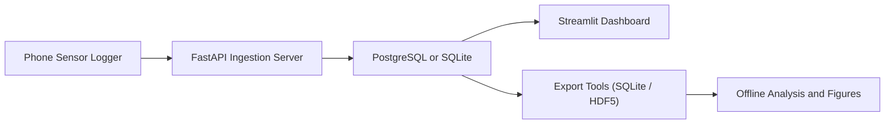
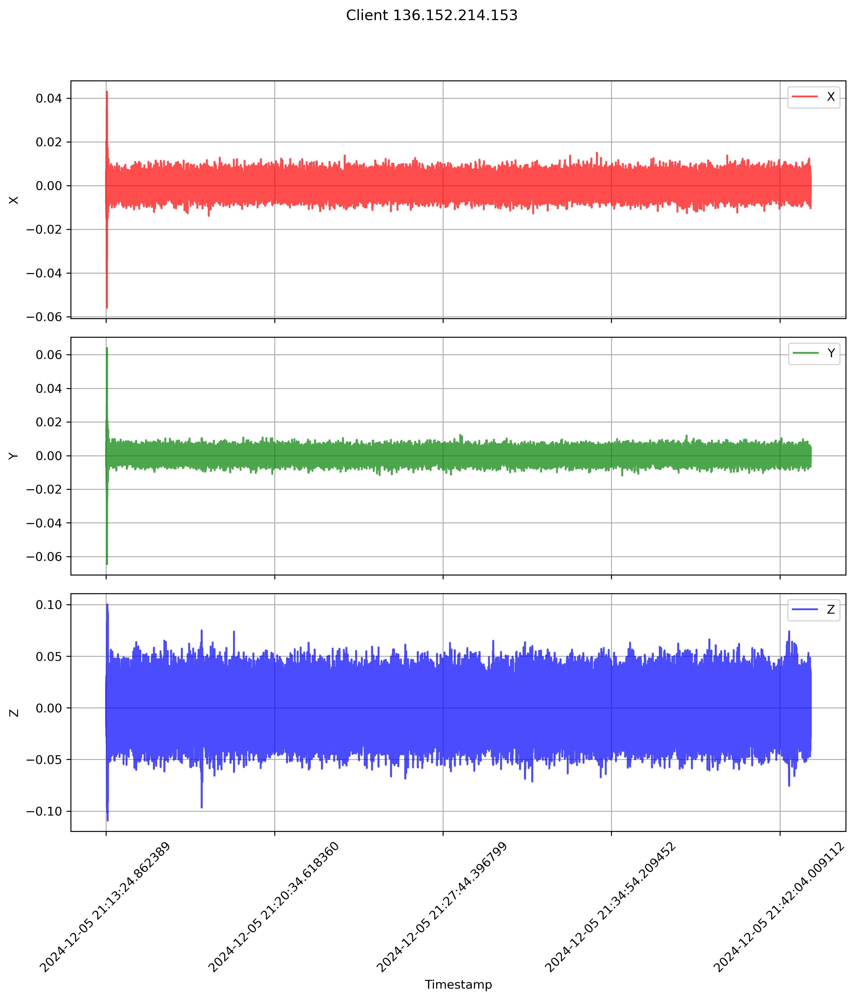
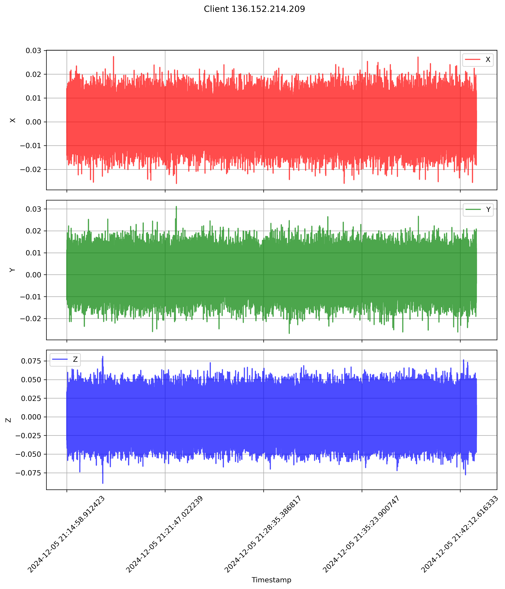

# Smartphone Sensor Logger and Realtime Seismic Dashboard

I built this repository to capture smartphone motion streams in realtime, store them in a database, and visualize waveform and spectrogram behavior for rapid shake-event inspection.

## What I Built
- A FastAPI ingestion server for high-frequency smartphone sensor payloads
- A Streamlit dashboard for realtime multi-axis waveform and spectrogram monitoring
- PostgreSQL and SQLite workflows for production and lightweight local runs
- Export utilities for SQLite and HDF5 archival pipelines
- Analysis scripts and saved case-study figures

## Architecture


## Quick Start (PostgreSQL Stack)
```bash
python3 -m venv .venv
source .venv/bin/activate
pip install -r requirements.txt
docker compose up -d postgres
python apps/postgresql/datacollection_server.py
```

In another terminal:
```bash
source .venv/bin/activate
streamlit run apps/postgresql/dashboard_streamlit.py --server.port 5000
```

## SQLite Stack
```bash
python apps/sqlite/datacollection_server.py
streamlit run apps/sqlite/dashboard_streamlit.py --server.port 5000
```

## Export Pipelines
```bash
python tools/export/export_postgres_to_sqlite.py
python tools/export/export_postgres_to_hdf5.py
```

## Helper Commands
```bash
make install
make postgres-up
make postgres-ingest
make postgres-dashboard
make export-sqlite
```

## Repository Layout
```text
apps/
  postgresql/      # I keep the PostgreSQL ingestion + dashboard apps here
  sqlite/          # I keep the SQLite ingestion + dashboard apps here
  experimental/    # I keep early-stage prototypes here
tools/
  export/          # I keep data export utilities here
  analysis/        # I keep standalone analysis scripts here
scripts/
  run/             # I keep operational launch scripts here
  setup/           # I keep EC2/bootstrap scripts here
assets/
  images/          # I keep dashboard and waveform snapshots here
  case-studies/    # I keep event-specific generated outputs here
docs/
  PROJECT_STRUCTURE.md
  OPERATIONS.md
```

## Demo Assets
- `assets/images/accelerometer_data_136_152_214_153.png`
- `assets/images/accelerometer_data_136_152_214_209.png`
- `assets/case-studies/petrolia_eq_dec12052024/`

## Preview


