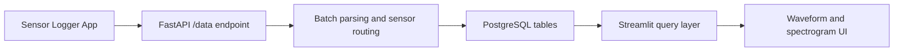

# Architecture

I designed this repository around a simple ingestion-storage-visualization pipeline.

## Data Flow

## Runtime Components
- Ingestion API: `apps/postgresql/datacollection_server.py`
- Dashboard UI: `apps/postgresql/dashboard_streamlit.py`
- SQLite fallback path: `apps/sqlite/`
- Export path: `tools/export/`

## Persistence Strategy
- I keep recent data in PostgreSQL for realtime dashboards.
- I export selected subsets to SQLite/HDF5 for reproducible offline analysis.
- I keep generated figures under `assets/` for portfolio and case-study reporting.
